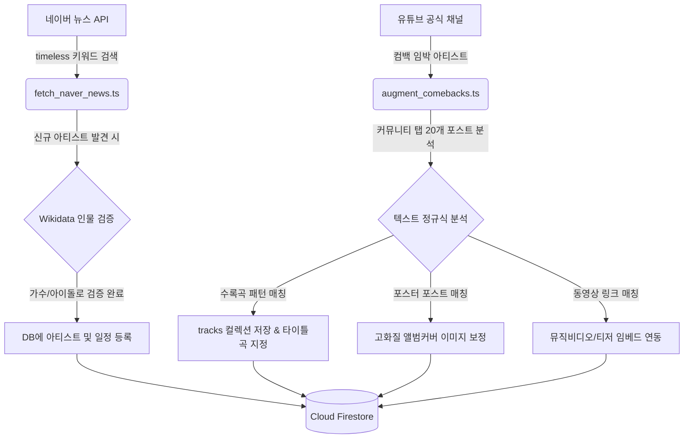

# 🌟 IDOL TRACKER — K-Pop 컴백 캘린더

> **K-Pop 아티스트들의 컴백 일정을 실시간으로 탐색하고, 유튜브 공식 커뮤니티 데이터를 파싱하여 트랙리스트와 공식 포스터 정보를 제공하는 스마트 일정 트래커입니다.**

이 프로젝트는 대규모 크롤링 시 발생하는 비용과 실패율을 줄이기 위해 **AI-Free 확정적(Deterministic) 데이터 수집 엔진**을 탑재하고 있으며, **Firestore 로컬 IndexedDB 캐싱 최적화**를 통해 트래픽 비용을 98% 이상 혁신적으로 절감하였습니다.

---

## 🚀 서비스 주요 기능 (Core Features)

1. **Bento-Grid 디자인 & 스마트 달력**:
   * HSL 배색이 적용된 웜테크 다크 모드 디자인 시스템 (`#0b0a09` Warm Carbon).
   * 월별 컴백 일정을 정규/미니/싱글 앨범 종류별 배지로 구분하여 캘린더 그리드에 렌더링.
   * 아티스트 타입별(그룹, 솔로, 유닛) 실시간 온디바이스 필터링 칩 제공.

2. **D-7 컴백 및 타임라인**:
   * 오늘 날짜 이후 예정된 다가오는 컴백 타임라인 렌더링.
   * 해당 아티스트의 공식 SNS 채널(유튜브, 인스타그램, 트위터, 위버스의 활성 링크) 및 소속사 정보 연동.

3. **고해상도 디테일 모달**:
   * 컴백 정보 클릭 시 모달 창 내부에 **공식 앨범 자켓 포스터**, **정밀 파싱된 수록곡 리스트(타이틀곡 하이라이트)** 렌더링.
   * 유튜브 뮤직비디오 티저/공식 MV **인앱 임베드 비디오 플레이어** 탑재.

---

## System Architecture

The project consists of three main components:
1.  **Frontend**: A Next.js application designed with a Warm-Tech and Bento-grid UI.
2.  **Database**: Firebase Firestore.
3.  **Data Automation Pipeline**:
    *   **Local Crawler Schedule (`launchd` / `cron`)**: Runs Python/TypeScript scripts daily.
    *   **Local LLM Parsing (Ollama + Qwen3)**: Replaces complex regex for accurately extracting `date`, `releaseType`, and `artistType` from Naver news articles without API costs.
    *   **Cross-Validation**: Uses YouTube Community scraping and Bugs API to verify missing or TBA data. Pipeline)

### 1) 신규 컴백 탐색기 (`fetch_naver_news.ts`)
* **원리**: 네이버 뉴스 API를 통해 `컴백 확정`, `신보 발매` 등의 보도자료를 수집하고 헤드라인을 정규식으로 분석하여 아티스트, 컴백일, 앨범 규격을 자동 발견합니다.
* **위키데이터 교차 분석**: 새로 감지된 생소한 이름은 **Wikidata API**의 직업/분류 메타데이터를 추적하여 실제 K-Pop 아티스트(가수, 보이그룹, 걸그룹 등)로 매칭 확인될 때만 자동으로 신규 아티스트 레코드를 등록합니다.

### 2) 인텐시브 보강 엔진 (`augment_comebacks.ts`)
* **원리**: 컴백 예정일이 임박한 아티스트의 유튜브 공식 채널 커뮤니티 탭 포스트 데이터를 긁어와 기획사 공식 앨범명, 트랙리스트(일련번호 패턴 기반), 고해상도 자켓 이미지 및 티저 영상 링크를 업데이트합니다.

---

## ⏰ 자동화 스케줄러 (GitHub Actions)

매일/매시간 크롤러를 돌려 불필요한 DB 읽기/쓰기가 소모되는 것을 막기 위해, 기획사들의 보도자료 및 티저 릴리즈 성향을 분석하여 효율적인 시간대로 배포했습니다.

1. **신규 컴백 탐색 (`naver_news_crawler.yml`)**
   * **주기**: 매주 화요일/목요일 오전 10:00 KST (평일 오전 보도자료 집중 배포 타임 타겟)
   * **동작**: 네이버 뉴스 API로 새로운 일정 발견 및 등록
2. **상세 정보 및 트랙리스트 보강 (`upcoming_augmentation.yml`)**
   * **주기**: 매일 오후 6:15 KST (K-Pop 기획사들의 오후 6:00 정각 티저 업로드 직후 타겟)
   * **동작**: 컴백 D-7 이내인 앨범을 타겟으로 유튜브 커뮤니티 포스팅 기반 최종 데이터 정밀 보강
