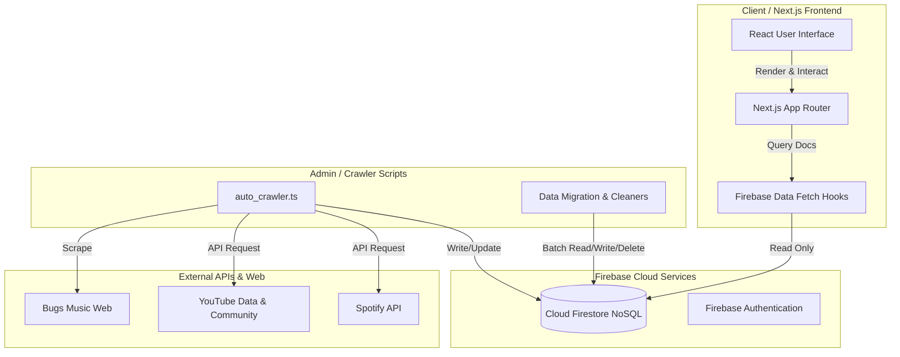

# System Architecture (시스템 아키텍처 및 소프트웨어 구성도)

## 1. 현행 시스템 구성 (Current System Configuration)

Idol Tracker 2026은 K-Pop 아이돌의 컴백 일정, 앨범 발매, 뮤직비디오, 트랙 정보 등을 시각적으로 제공하는 캘린더형 웹 플랫폼입니다.

### 1.1 주요 서비스 (프론트엔드)
*   **월별 캘린더 (Calendar Grid):** 특정 월의 모든 컴백 일정을 일자별로 그리드 형태로 시각화.
*   **컴백 타임라인 (Upcoming Timeline):** 오늘 날짜 기준으로 다가오는 가장 빠른 컴백 정보 최대 10건을 타임라인 형태로 표시.
*   **아티스트 상세 (Artist Profile):** 특정 아티스트의 프로필, 소셜 미디어 링크, 최신 뮤직비디오, 전체 컴백 히스토리 제공.
*   **컴백 상세 (Comeback Detail):** 단일 컴백(앨범)의 뮤직비디오, 전체 트랙리스트, 각 트랙의 작사/작곡 정보, 음원 스트리밍 링크 제공.

### 1.2 지원 업무 (운영 및 백그라운드)
*   **데이터 크롤러:** Bugs Music, YouTube, Spotify 등을 주기적으로 스크래핑하여 새로운 아티스트와 앨범 데이터를 발굴하고 데이터베이스에 적재.
*   **데이터 정제 및 보완 스크립트:** 중복 데이터 병합, 식별자(ID) 정규화, 누락된 트랙 크레딧 및 뮤직비디오 주소 백필링(Backfilling).

---

## 2. 시스템 아키텍쳐 구성도 (System Architecture Diagram)



---

## 3. 소프트웨어 구성도 (Software Architecture)

### 3.1 기술 스택
*   **Framework:** Next.js 16 (App Router 기반)
*   **Library:** React 19, TypeScript
*   **Database:** Firebase Firestore (NoSQL Document Store)
*   **Styling:** Vanilla CSS (globals.css), Lucide React & React Icons (아이콘 패키지)
*   **Data Fetching & Automation (Scripts):**
    *   `cheerio`: 웹 스크래핑 및 HTML 파싱
    *   `youtubei.js` / `yt-search`: YouTube 비공식 API 및 검색 크롤링
    *   `spotify-web-api-node`: Spotify 공식 API 연동
    *   `duck-duck-scrape` / `google-it`: 외부 메타데이터 검색

### 3.2 디렉토리 구조 (Directory Structure)

```text
/idol_tracker
 ├── app/                      # Next.js App Router 페이지 및 전역 CSS
 │   ├── _components/          # 전역 및 재사용 가능한 React 컴포넌트
 │   ├── artist/               # 아티스트 상세 페이지 라우트 (/artist?id=...)
 │   ├── comeback/             # 컴백 상세 페이지 라우트 (/comeback?id=...)
 │   ├── track/                # 곡 상세 페이지 라우트 (/track?id=...)
 │   └── firebase.ts           # Firebase 클라이언트 SDK 초기화 설정
 ├── types/                    # 시스템 전역 TypeScript 타입 및 인터페이스 정의 (index.ts)
 ├── scripts/                  # 크롤링, 데이터 백필링, DB 마이그레이션 백엔드 스크립트 모음
 │   └── lib/                  # 스크립트 공통 유틸리티 모음 (로거, 딜레이 함수 등)
 ├── docs/                     # 시스템 문서화 폴더
 ├── package.json              # 패키지 의존성 및 스크립트 명령어 관리
 └── firebase.json             # Firebase 호스팅 및 기타 Firebase 서비스 설정
```
